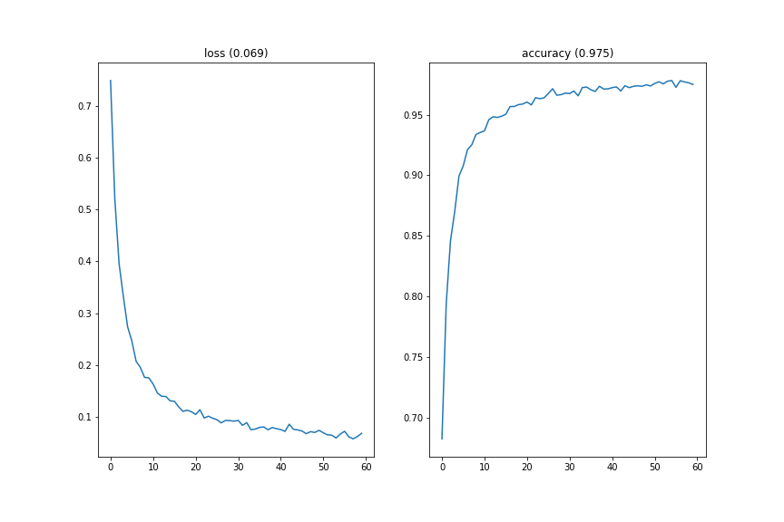
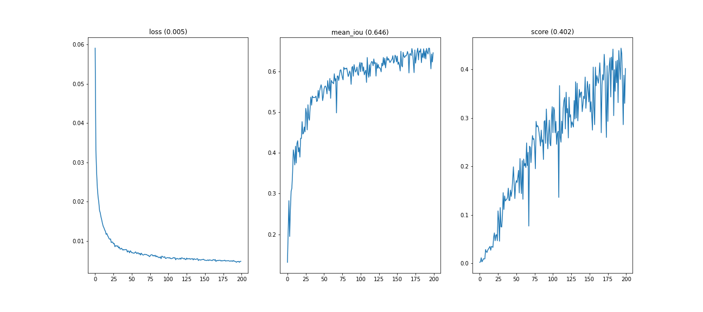
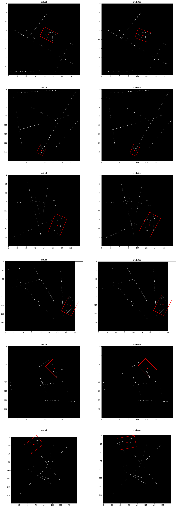
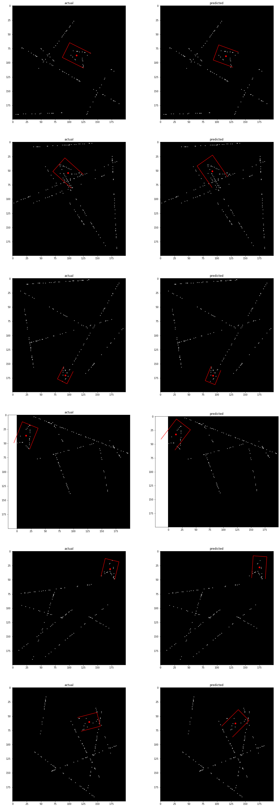

# Problem
The goal is to build a deep learning model that can detect a hidden spaceship inside a noisy image. The model will take a single channel image as input and predict the rotated bounding box of the spaceship (if it exists). The bounding box can be described using five parameters:
- X and Y position (centre of the bounding box)
- Yaw (direction of heading)
- Width (size tangential to the direction of yaw)
- Height (size along the direct of yaw)

Not all images will contain a spaceship, but they will contain no more than 1. The metric used to evaluate the model will be the the Average Precision at an IoU threshold of 0.7. See `PROBLEM.md` for a full problem description and setup code.

- [Problem](#problem)
- [Data](#data)
  - [Label](#label)
  - [Image](#image)
- [Approach](#approach)
  - [Preprocessing](#preprocessing)
  - [Modeling](#modeling)
    - [Task 1: Binary Classification](#task-1-binary-classification)
    - [Task 2: Bounding Box Regression](#task-2-bounding-box-regression)
    - [Model Architecture](#model-architecture)
      - [Classification Model Summary](#classification-model-summary)
      - [Regresssion Model Summary](#regresssion-model-summary)
    - [Modeling Choices](#modeling-choices)
  - [Training](#training)
    - [Classification Training Metrics](#classification-training-metrics)
    - [Regression Training Metrics](#regression-training-metrics)
- [Final Results](#final-results)
    - [The Good (score > 0.7)](#the-good-score--07)
    - [The Bad (0.55 < score < 0.65)](#the-bad-055--score--065)
    - [The Ugly (score < 0.2)](#the-ugly-score--02)


# Data
The data is generated from the `make_data()` function found in `helpers.py`. Each call of the function returns a new randomly generated input image, as well as it's associated label.

## Label
The label is a 1D numpy array of length 5 that is either `nan` if a spaceship is not present in the input image, or contains the following values:

| index | label name   |   min value |   max value | dtype   |
|------:|:-------------|------------:|------------:|:--------|
|   0   | center x     |           0 |     200     | float32 |
|   1   | center y     |           0 |     200     | float32 |
|   2   | yaw          |           0 |    6.283    | float32 |
|   3   | width        |           0 |      37     | float32 |
|   4   | height       |           0 |      74     | float32 |

**Note:** The max value of height is actually unbounded since it is sampled from a normal distribution, however it is highly unlikely for it to surpass 74.

## Image
The input image is a 200 by 200 numpy array of `float32` values ranging from 0 (black) to 1 (white). Each image contains 3 elements:
1. Random noise
2. Lines
3. A spaceship (if it exists)

The below grid of images shows each of the 3 individual elements, and also the final image that is outputed by the `make_data` function, which is just the sum of all 3 elements. As you can see, the noise and the lines help hide the spaceship in the final image. The spaceship's ground truth bounding box is shown in red.


# Approach
## Preprocessing
Before inputting the image into our model, we preprocess the image by removing the random noise layer, leaving just the spaceship and lines:

```python
def preprocess_image(img):
    return np.where(img >= NOISE_LEVEL, img, 0.0)
```


While this does remove a lot of the noise and makes the spaceship much easier to see, it comes with a tradeoff. We lose some information since a portion of the pixels on the spaceship are less than the threshold, and hence are removed. This is why the spaceship and lines appear fragmented in the preprocessed image. These lost pixels might've been useful information for our model, since the average value of those pixels would be greater than the average value of the surrounding pixels.

## Modeling
We can split the problem into 2 subproblems:

### Task 1: Binary Classification
Determine if a spaceship exists in the image (1 for yes, 0 for no).

- **Input:** Preprocessed Image
- **Label:** `float32` that is either 0 if no spaceship in image, or 1 if spaceship in image
- **Output:** `float32` between 0 and 1
- **Criterion:** Binary Cross Entropy
- **Evaluation Metric:** Accuracy (Weigthed Recall)

### Task 2: Bounding Box Regression
Determine the bounding box of the spaceship (regression on the 5 **normalized** bounding box values).

- **Input:** Preprocessed Image
- **Label:** Normalized bounding box label (`float32` array of length 5 with values between 0 and 1)
- **Output:** `float32` array of length 5 with values between 0 and 1
- **Criterion:** Mean-Squared Error (MSE)
- **Evaluation Metrics:** Mean IoU, Accuracy at an IoU Threshold of 0.7
- **Note:** We normalize the label values as to not bias the error function towards a specific parameter in the label.

### Model Architecture
Both the classification and regression models are convolutional neural networks. Pasted below are the keras model summaries for the classification and regression models respectively (total params between both models = `1,810,758`):

#### Classification Model Summary
```
Model: "sequential_1"
_________________________________________________________________
Layer (type)                 Output Shape              Param #
=================================================================
reshape_1 (Reshape)          (None, 200, 200, 1)       0
_________________________________________________________________
conv2d_7 (Conv2D)            (None, 200, 200, 8)       976
_________________________________________________________________
batch_normalization_7 (Batch (None, 200, 200, 8)       32
_________________________________________________________________
max_pooling2d_7 (MaxPooling2 (None, 100, 100, 8)       0
_________________________________________________________________
conv2d_8 (Conv2D)            (None, 100, 100, 16)      10384
_________________________________________________________________
batch_normalization_8 (Batch (None, 100, 100, 16)      64
_________________________________________________________________
max_pooling2d_8 (MaxPooling2 (None, 50, 50, 16)        0
_________________________________________________________________
conv2d_9 (Conv2D)            (None, 50, 50, 32)        25120
_________________________________________________________________
batch_normalization_9 (Batch (None, 50, 50, 32)        128
_________________________________________________________________
max_pooling2d_9 (MaxPooling2 (None, 25, 25, 32)        0
_________________________________________________________________
conv2d_10 (Conv2D)           (None, 25, 25, 64)        51264
_________________________________________________________________
batch_normalization_10 (Batc (None, 25, 25, 64)        256
_________________________________________________________________
max_pooling2d_10 (MaxPooling (None, 12, 12, 64)        0
_________________________________________________________________
conv2d_11 (Conv2D)           (None, 12, 12, 128)       73856
_________________________________________________________________
batch_normalization_11 (Batc (None, 12, 12, 128)       512
_________________________________________________________________
max_pooling2d_11 (MaxPooling (None, 6, 6, 128)         0
_________________________________________________________________
flatten_1 (Flatten)          (None, 4608)              0
_________________________________________________________________
dense_1 (Dense)              (None, 1)                 4609
=================================================================
Total params: 167,201
Trainable params: 166,705
Non-trainable params: 496
_________________________________________________________________
```

#### Regresssion Model Summary
```
Model: "sequential"
_________________________________________________________________
Layer (type)                 Output Shape              Param #
=================================================================
reshape (Reshape)            (None, 200, 200, 1)       0
_________________________________________________________________
conv2d (Conv2D)              (None, 200, 200, 8)       976
_________________________________________________________________
batch_normalization (BatchNo (None, 200, 200, 8)       32
_________________________________________________________________
max_pooling2d (MaxPooling2D) (None, 100, 100, 8)       0
_________________________________________________________________
conv2d_1 (Conv2D)            (None, 100, 100, 16)      10384
_________________________________________________________________
batch_normalization_1 (Batch (None, 100, 100, 16)      64
_________________________________________________________________
max_pooling2d_1 (MaxPooling2 (None, 50, 50, 16)        0
_________________________________________________________________
conv2d_2 (Conv2D)            (None, 50, 50, 32)        25120
_________________________________________________________________
batch_normalization_2 (Batch (None, 50, 50, 32)        128
_________________________________________________________________
max_pooling2d_2 (MaxPooling2 (None, 25, 25, 32)        0
_________________________________________________________________
conv2d_3 (Conv2D)            (None, 25, 25, 64)        51264
_________________________________________________________________
batch_normalization_3 (Batch (None, 25, 25, 64)        256
_________________________________________________________________
max_pooling2d_3 (MaxPooling2 (None, 12, 12, 64)        0
_________________________________________________________________
conv2d_4 (Conv2D)            (None, 12, 12, 128)       73856
_________________________________________________________________
batch_normalization_4 (Batch (None, 12, 12, 128)       512
_________________________________________________________________
max_pooling2d_4 (MaxPooling2 (None, 6, 6, 128)         0
_________________________________________________________________
conv2d_5 (Conv2D)            (None, 6, 6, 256)         295168
_________________________________________________________________
batch_normalization_5 (Batch (None, 6, 6, 256)         1024
_________________________________________________________________
max_pooling2d_5 (MaxPooling2 (None, 3, 3, 256)         0
_________________________________________________________________
conv2d_6 (Conv2D)            (None, 3, 3, 512)         1180160
_________________________________________________________________
batch_normalization_6 (Batch (None, 3, 3, 512)         2048
_________________________________________________________________
max_pooling2d_6 (MaxPooling2 (None, 1, 1, 512)         0
_________________________________________________________________
flatten (Flatten)            (None, 512)               0
_________________________________________________________________
dense (Dense)                (None, 5)                 2565
=================================================================
Total params: 1,643,557
Trainable params: 1,641,525
Non-trainable params: 2,032
_________________________________________________________________
```

### Modeling Choices
The complexity of the classification problem was lower than that of the regression problem, so we can get away with using a smaller network for classification without sacrificing performance.

I also decided to use a large kernel size for the first couple of convolutional layers, since the pixels were sparse and the features we wanted to detect were large.

Another key choice was the decision to preprocess the images. The preprocessing step removed much of the noise, which helped the model converge faster (or converge at all in some cases).

Probably the most important choice was the decision to normalize the regression labels, which was especially important for the model to learn the yaw of the spaceship. Without normalization, the error function would give more importance to the x and y label as compared to the yaw label since `150 - 100` will give a much higher error than `3.00 - 1.50`, even though both of those predictions are wrong by the same margin).

## Training
The models were optimized using the `Adam` algorithm with an initial learning rate of `1e-3`. Each model saw about a million or so examples in the training process.

The models can be reproduced by running the `train.py` script. Training both models will take ~1.5 hours combined using a Tesla T4 GPU.

```bash
python train.py
```

### Classification Training Metrics



### Regression Training Metrics



# Final Results
The final evaluation score can be reproduced using the `main.py` script.

```bash
python main.py
```

**Score:** 0.46879

**Mean IoU:** 0.66012

**IoU Distribution:**


**Classification Report:**
```
              precision    recall  f1-score   support

           0       0.93      0.96      0.95      2052
           1       0.99      0.98      0.99      7948

    accuracy                           0.98     10000
   macro avg       0.96      0.97      0.97     10000
weighted avg       0.98      0.98      0.98     10000
```

### The Good (score > 0.7)



### The Bad (0.55 < score < 0.65)



### The Ugly (score < 0.2)


